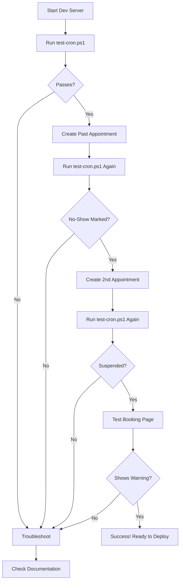

# Automatic No-Show Detection System - Documentation Index

## 📋 Quick Navigation

### 🚀 **I want to test it right now**
→ Read: [`QUICK_TEST_GUIDE.md`](./QUICK_TEST_GUIDE.md)
⏱️ Time: 5 minutes

### 🧪 **I want detailed testing instructions**
→ Read: [`docs/TESTING_NO_SHOW_SYSTEM.md`](./docs/TESTING_NO_SHOW_SYSTEM.md)
⏱️ Time: 30 minutes (includes creating test data)

### ⚙️ **I want to deploy to production**
→ Read: [`CRON_SETUP_COMPLETE.md`](./CRON_SETUP_COMPLETE.md)
⏱️ Time: 10 minutes (after testing)

### 📖 **I want to understand the system**
→ Read: [`docs/NO_SHOW_SYSTEM_SETUP.md`](./docs/NO_SHOW_SYSTEM_SETUP.md)
⏱️ Time: 15 minutes (comprehensive overview)

---

## 🎯 What This System Does

**Automatic No-Show Detection**:
- Runs daily at 1:00 AM PHT
- Checks for appointments 24+ hours overdue
- Marks overdue appointments as "no-show"
- Tracks no-show count per patient

**Account Suspension**:
- 2 no-shows → Account suspended for 1 month
- Suspended patients cannot book appointments
- Automatic reinstatement after suspension period
- In-app notifications sent to patients

---

## 📁 Files Reference

### Test Scripts
- **`test-cron.ps1`** - PowerShell script to test cron endpoint

### Documentation
- **`QUICK_TEST_GUIDE.md`** - 5-minute quick start
- **`CRON_SETUP_COMPLETE.md`** - Production deployment guide
- **`docs/TESTING_NO_SHOW_SYSTEM.md`** - Detailed testing procedures
- **`docs/NO_SHOW_SYSTEM_SETUP.md`** - System architecture & setup

### Configuration
- **`.env.local`** - Contains `CRON_SECRET_TOKEN`
- **`vercel.json`** - Vercel Cron schedule
- **`.github/workflows/no-show-detection.yml`** - GitHub Actions workflow

### Source Code
- **`src/lib/utils/appointmentUtils.ts`** - Core no-show detection logic
- **`src/app/api/cron/check-no-shows/route.ts`** - Cron API endpoint
- **`src/app/api/appointments/route.ts`** - Suspension check in booking
- **`src/app/(dashboard-patient)/patient/book-appointment/page.tsx`** - Suspension UI

### Database
- **Migration**: `add_no_show_tracking_to_patients` (already applied)
- **New columns**: `no_show_count`, `suspended_until`, `last_no_show_at`

---

## 🔑 Key Information

### Credentials
```
CRON_SECRET_TOKEN: 6e6a66756d9d2ad952598f78eda08b77e800b13e79406b1a5f77e9e1dc38ec44
```

### Endpoints
```
Health Check:   GET  http://localhost:3000/api/cron/check-no-shows
Execute Cron:   POST http://localhost:3000/api/cron/check-no-shows
                      (requires Authorization header)
```

### Schedule
```
Vercel Cron:        0 17 * * *  (5:00 PM UTC = 1:00 AM PHT)
GitHub Actions:     0 17 * * *  (same as above)
```

---

## ✅ Testing Workflow



---

## 🚀 Deployment Checklist

### Before Deploying
- [ ] Tested locally with `test-cron.ps1`
- [ ] Created test appointments and verified no-show detection
- [ ] Tested suspension after 2 no-shows
- [ ] Verified booking page shows suspension warning
- [ ] Cleaned up test data

### Deploy to Vercel
- [ ] Add `CRON_SECRET_TOKEN` to Vercel environment variables
- [ ] Commit and push all changes
- [ ] Verify `vercel.json` is in repository
- [ ] Check Vercel Dashboard → Crons tab after deployment

### Deploy with GitHub Actions
- [ ] Add `CRON_SECRET_TOKEN` to GitHub Secrets
- [ ] Add `PRODUCTION_URL` to GitHub Secrets
- [ ] Push `.github/workflows/no-show-detection.yml`
- [ ] Enable Actions in repository settings
- [ ] Test manual workflow trigger

### Post-Deployment
- [ ] Monitor first automatic cron execution
- [ ] Check logs in Vercel/GitHub Actions
- [ ] Verify no errors in production database
- [ ] Test with real user (optional)

---

## 🆘 Common Issues

| Issue | Solution | Documentation |
|-------|----------|---------------|
| PowerShell script blocked | Run: `Set-ExecutionPolicy RemoteSigned` | QUICK_TEST_GUIDE.md |
| Cron returns 401 | Check CRON_SECRET_TOKEN in .env.local | CRON_SETUP_COMPLETE.md |
| No appointments checked | Create past appointments (>24h old) | TESTING_NO_SHOW_SYSTEM.md |
| Suspension not working | Verify migration applied | NO_SHOW_SYSTEM_SETUP.md |
| Booking still allowed | Check frontend suspension check | TESTING_NO_SHOW_SYSTEM.md |

---

## 📊 Monitoring

### Database Queries

**Check Recent No-Shows:**
```sql
SELECT * FROM appointments WHERE status = 'no_show' ORDER BY updated_at DESC LIMIT 10;
```

**Check Suspended Patients:**
```sql
SELECT p.patient_number, p.no_show_count, p.suspended_until, prof.status
FROM patients p
JOIN profiles prof ON p.user_id = prof.id
WHERE prof.status = 'suspended';
```

**Check System Statistics:**
```sql
SELECT
  COUNT(*) FILTER (WHERE status = 'no_show') as total_no_shows,
  COUNT(*) FILTER (WHERE status = 'scheduled') as total_scheduled,
  COUNT(*) FILTER (WHERE status = 'completed') as total_completed
FROM appointments
WHERE appointment_date > CURRENT_DATE - INTERVAL '30 days';
```

### Logs

**Vercel Dashboard:**
- Deployments → Functions → View logs
- Crons tab → Execution history

**GitHub Actions:**
- Actions tab → Daily No-Show Detection → View logs

---

## 🎓 Learning Path

### For Developers
1. Read `NO_SHOW_SYSTEM_SETUP.md` (architecture overview)
2. Review `appointmentUtils.ts` (core logic)
3. Test with `TESTING_NO_SHOW_SYSTEM.md`
4. Deploy with `CRON_SETUP_COMPLETE.md`

### For Testers
1. Start with `QUICK_TEST_GUIDE.md`
2. Follow `TESTING_NO_SHOW_SYSTEM.md` step-by-step
3. Verify all checklist items pass

### For DevOps
1. Review `CRON_SETUP_COMPLETE.md` (deployment)
2. Configure Vercel/GitHub Actions
3. Set up monitoring and alerts

---

## 📞 Support

**Questions?**
- Check the troubleshooting section in each guide
- Review the complete documentation set
- Test locally before deploying
- Monitor logs after deployment

**Found a bug?**
- Check if issue is documented in "Common Issues"
- Review recent changes in git history
- Test with clean database

---

## 🎉 Quick Start Command

```powershell
# One-line test:
cd C:\Users\User\Documents\first_year_files\folder_for_jobs\HealthCard\Health-Card-Go; .\test-cron.ps1
```

---

**Ready to get started? Open [`QUICK_TEST_GUIDE.md`](./QUICK_TEST_GUIDE.md) and follow the 5-minute guide!** 🚀

---

**System Version:** 1.0.0
**Last Updated:** December 21, 2025
**Maintained By:** Development Team
